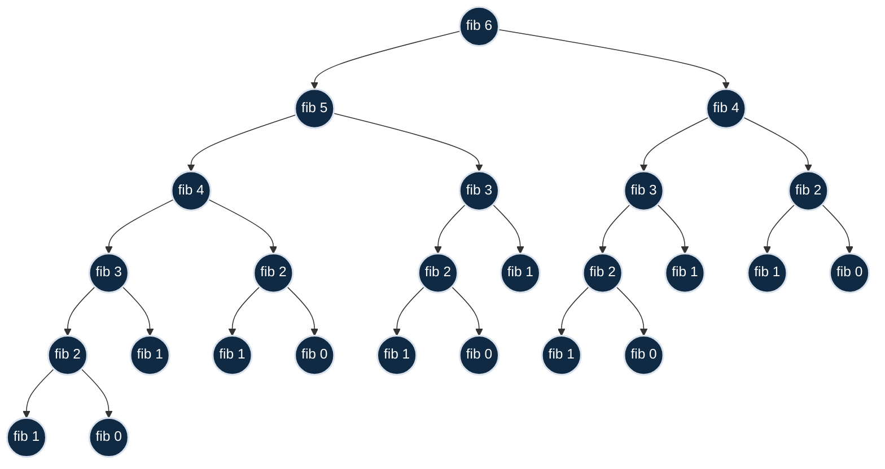
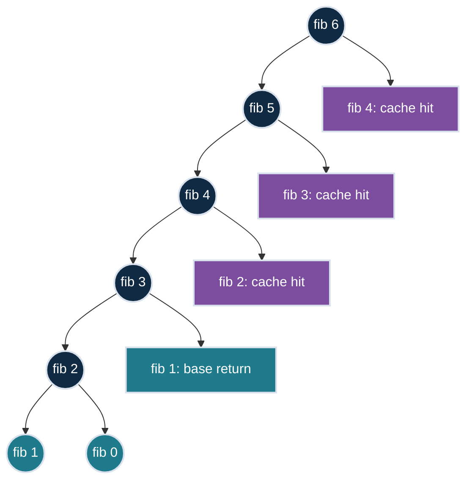

# Memoization idea

Visualize as a tree, getting a working solution using recursion, add a memo object.

# Execution tree: `fibo_recursive(6)`

Repeated work: `fib 4`, `fib 3`, `fib 2`, `fib 1`, `fib 0`

# Execution tree: `fibo_memo(6)`

Computed once. Reused from cache.